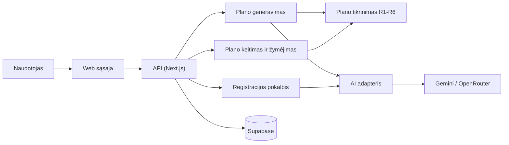

# Spotter

Kursinio darbo I dalis: projektavimo dokumentas

## 1. Problema ir idėja

**Sistema vienu sakiniu:** Spotter yra web programa, kurioje galima pačiam susidaryti treniruočių planą arba sugeneruoti jį su AI, o sistema patikrina, ar planas tinka tavo laikui, įrangai ir sveikatai.

**Problema ir dabartinis procesas:** Dauguma pradedančiųjų planą randa internete arba paklausia ChatGPT. Iš interneto paimtas planas nėra pritaikytas konkrečiam žmogui. ChatGPT sugeneruotą planą niekas netikrina, todėl jame gali būti pritūpimų žmogui, kuriam skauda kelį, treniruotė gali užtrukti ilgiau, nei žmogus turi laiko, arba tie patys raumenys gali būti treniruojami kelias dienas iš eilės. Treneris tokių klaidų nedarytų, bet jis brangus. Dar viena problema: planas dažniausiai būna užsirašytas telefone ar Excel faile, todėl nepatogu žymėtis, kas jau padaryta.

**Nauda:** Viskas vienoje vietoje: planas, kuriuo galima pasitikėti, ir aiškiai matoma, kiek treniruočių šią savaitę jau padaryta.

**Naudotojai:** Žmogus, kuris sportuoja pats, be trenerio. Jis užsiregistruoja per trumpą pokalbį su botu, sugeneruoja planą arba susikuria jį pats, prireikus pakeičia ir žymisi atliktus pratimus.

**Prielaidos:**
- Panašių programų jau yra (Fitbod, Everfit, Trainerize), vadinasi, poreikis tikrai yra.
- Kuriems pratimams kokie skausmai trukdo, pažymėsiu pats savo pratimų sąraše. Abejodamas žymėsiu griežčiau. Tai nėra gydytojo patarimas.
- Tikiu tuo, ką apie savo skausmus parašo naudotojas, sistema to netikrina.

## 2. Apimtis

| Funkcija | Ką naudotojas galės atlikti | Pagrindinis modulis ar pagalbinė funkcija |
|---|---|---|
| Plano generavimas su AI ir tikrinimas | Gauti savaitės planą, kuriame nėra taisyklių pažeidimų | **Pagrindinis modulis** |
| Plano kūrimas ir keitimas rankomis | Pačiam susidėti pratimus, serijas ir dienas arba pakeisti AI planą. Jei kas nors negerai, sistema parodo įspėjimą | Pagalbinė (naudoja tą patį tikrinimą) |
| Atliktų treniruočių žymėjimas | Pažymėti pratimą ar visą dieną kaip atliktą ir matyti savaitės progresą (pvz., „2 iš 3“) | Pagalbinė |
| Registracija per pokalbį su AI | Atsakyti į boto klausimus. Botas pats užpildo profilį, naudotojas jį patvirtina | Pagalbinė |

**Į kursinio darbo apimtį neįeina:** mityba, mokėjimai, mobilioji programėlė, sujungimas su laikrodžiais, automatinis krūvio didinimas kas savaitę, pratimų vaizdo įrašai.

## 3. Pagrindinis modulis

**Pavadinimas ir atsakomybė:** Plano generavimas ir tikrinimas. AI sudaro planą, o sistema jį patikrina pagal taisykles R1–R6. Jei randa klaidų, grąžina jas AI pataisyti. Jei AI nepataiso ir antrą kartą, sistema pati sudaro paprastą planą be AI. Sugeneruotas planas su klaidomis naudotojui niekada neparodomas.

**Logika, kurią reikės projektuoti ir testuoti:** tinkamų pratimų atrinkimas prieš siunčiant užklausą AI, AI atsakymo formato patikra, taisyklės R1–R6, antras bandymas ir paprastas planas be AI.

**Įvestis:** naudotojo profilis ir pratimų sąrašas. Pvz.: pradedantysis, sportuoja pirmadienį, trečiadienį ir penktadienį po 45 min., turi hantelius, niekas neskauda. Pratimo įrašas: „Hantelių spaudimas gulint“, krūtinė, reikia hantelių, sudėtingumas 1, netinka skaudant petį, viena serija užtrunka 2 min.

**Išvestis:** savaitės planas (dienos, pratimai, serijos, pakartojimai, kiek užtruks), būsena ir rastų klaidų sąrašas. Būsena būna viena iš trijų: `PARUOSTAS`, `SUPAPRASTINTAS` (planas sudarytas be AI) arba `KLAIDA`.

**Veikimo eiga:**
1. Iš sąrašo atrenkami pratimai, kurie tinka pagal įrangą, skausmus ir lygį. Jei lieka mažiau nei 6, rodoma klaida ir AI net nekviečiamas.
2. AI gauna profilį ir tik atrinktus pratimus, o atgal grąžina planą JSON formatu.
3. Pirma tikrinamas formatas, tada taisyklės R1–R6.
4. Jei klaidų nėra, planas išsaugomas. Jei yra, AI gauna klaidų sąrašą ir vieną kartą bando pataisyti.
5. Jei ir antras bandymas nepavyksta, sistema pati sudaro viso kūno planą iš atrinktų pratimų ir jį irgi patikrina.

Kai planą kuria ar keičia pats naudotojas, tikrinama pagal tas pačias taisykles, tik klaidos rodomos kaip įspėjimai ir planą vis tiek galima išsaugoti.

### Taisyklės arba sprendimo žingsniai

1. **R1 Įranga:** pratimui reikalinga įranga turi būti tarp tos, kurią naudotojas turi.
2. **R2 Skausmai:** plane negali būti pratimo, kuris netinka dėl naudotojo nurodyto skausmo (pvz., pritūpimai, kai skauda kelį).
3. **R3 Dienos:** treniruočių dienų yra tiek, kiek nurodyta profilyje, ir jos visos yra tomis dienomis, kurias naudotojas pasirinko.
4. **R4 Trukmė:** 10 min. apšilimas + visų dienos pratimų serijos × vienos serijos trukmė turi neviršyti naudotojo nurodyto laiko.
5. **R5 Poilsis:** tie patys raumenys netreniruojami dvi dienas iš eilės (sekmadienis ir pirmadienis irgi laikomi gretimomis dienomis).
6. **R6 Lygis:** pratimo sudėtingumas negali būti didesnis už naudotojo lygį (1, 2 arba 3). Pradedančiajam ne daugiau kaip 3 serijos vienam pratimui.

Dar viena bendra sąlyga: visi pratimai turi būti iš sistemos sąrašo. AI negali sugalvoti savo pratimo.

### Scenarijai būsimiems testams

| Scenarijus | Pradinės sąlygos ir konkreti įvestis | Veiksmas | Tikslus laukiamas rezultatas |
|---|---|---|---|
| Įprastas atvejis | Pradedantysis, Pr/Tr/Pn, 45 min., hanteliai. AI grąžina kiekvienai dienai 5 viso kūno pratimus po 3 serijas (serija 2 min.) | Generuoti planą | 0 klaidų, diena trunka 10 + 15 × 2 = 40 min., būsena `PARUOSTAS`, 1 bandymas |
| Konfliktas | Vidutinis lygis, Pr/An/Kt/Pn, 60 min., sporto salė, skauda kelį. Pirmame AI plane krūtinė treniruojama ir Pr, ir An, o Kt yra „pritūpimai su štanga“. Antras planas be klaidų | Generuoti planą | Po 1 bandymo 2 klaidos: R5 (krūtinė Pr ir An) ir R2 (pritūpimai, kelis). Po 2 bandymo 0 klaidų, būsena `PARUOSTAS`, 2 bandymai |
| AI nepataiso | Tas pats profilis, bet AI abu kartus pirmadieniui duoda 30 serijų (10 + 60 = 70 min., o leidžiama 60) | Generuoti planą | Du kartus R4 klaida, tada sistema pati sudaro planą be klaidų, būsena `SUPAPRASTINTAS` |
| Klaida | Pradedantysis, namie be jokios įrangos, skauda kelį, nugarą ir petį. Po atrinkimo lieka 3 pratimai | Generuoti planą | AI nekviečiamas, būsena `KLAIDA`, naudotojui siūloma pakeisti įrangą arba skausmų sąrašą |
| Rankinis pakeitimas | Naudotojas, kuriam skauda kelį, antradienio treniruotei pats prisideda „pritūpimus su štanga“ | Išsaugoti | Rodomas R2 įspėjimas, planas išsaugomas su žyma „yra įspėjimų“ |

Testuose tikras AI nebus kviečiamas. Vietoj jo naudosiu iš anksto paruoštus JSON atsakymus, kad rezultatas kiekvieną kartą būtų toks pat.

**Jei modulis naudoja AI:** AI gauna tik profilio laukus ir atrinktų pratimų sąrašą, o ne tai, ką naudotojas laisvai prirašė. Atsakymą tikrinu pagal JSON schemą ir taisykles. Jei atsakymas blogas, leidžiu vieną pataisymą, o po to sudarau paprastą planą be AI. Taip pat elgiuosi, jei AI neatsako per 30 s. Kokybę tikrinsiu su 20 paruoštų profilių. Tikslas: bent 70 % planų be klaidų iš pirmo karto ir bent 90 % iš dviejų kartų. Registracijos pokalbyje AI iš atsakymų ištraukia profilio laukus, o sistema patikrina, ar reikšmės normalios (pvz., sportuoti galima nuo 2 iki 6 dienų per savaitę). Jei ne, botas paklausia dar kartą. Profilis išsaugomas tik naudotojui jį patvirtinus.

## 4. Kokybės atributas

**Pasirinktas atributas:** patikimumas. Naudotojas neturi gauti AI plano su klaidomis.

**Kodėl svarbus šiai sistemai:** Tai visos programos esmė. Jei žmogus su skaudančiu keliu gautų pritūpimus, programa niekuo nesiskirtų nuo paprasto ChatGPT.

**Tikrinimo scenarijus ir sąlygos:** 50 testinių profilių ir 30 specialiai sugadintų AI atsakymų. Kiekviename yra bent viena R1–R6 klaida arba neteisingas formatas.

**Sėkmės kriterijus:** sistema randa klaidas visuose 30 sugadintų atsakymų ir nurodo teisingą taisyklę, o nė vienas sugeneruotas planas su klaida nepasiekia naudotojo.

**Numatytas projektavimo sprendimas:** tikrinimas yra atskiras modulis, kuris nepriklauso nei nuo AI, nei nuo duomenų bazės. AI kviečiamas tik per vieną adapterį, todėl testuose jį lengva pakeisti paruoštais atsakymais. Paprastas planas be AI taip pat tikrinamas.

**Kaip patikrinsiu vėlesniame etape:** automatiniais testais su Vitest.

**Sprendimo kaina arba ribojimas:** antras AI kvietimas ilgina laukimą ir kainuoja daugiau, o planas be AI yra mažiau pritaikytas žmogui.

## 5. Pradinė sistemos struktūra

### Paprasta schema

| Sistemos dalis | Atsakomybė |
|---|---|
| Web sąsaja | Pokalbis, plano peržiūra ir keitimas, atliktų pratimų žymėjimas |
| API | Tikrina, ar naudotojas prisijungęs, ir kviečia kitas dalis |
| Plano generavimas | Pratimų atrinkimas, AI kvietimas, antras bandymas, planas be AI |
| Plano tikrinimas | Taisyklės R1–R6, naudojamos ir AI, ir rankomis sudarytiems planams |
| AI adapteris | Vienintelė vieta, iš kurios kviečiamas AI, todėl modelį pakeisti paprasta |
| Supabase | Naudotojai, profiliai, pratimų sąrašas, planai, atlikti pratimai, AI bandymų istorija |

**Planuojamos technologijos ir pasirinkimo priežastys:**
- **Next.js (TypeScript)** ir **Vercel**: frontend ir backend viename projekte, o įkėlus į GitHub viskas automatiškai atsinaujina. Su šiais įrankiais jau esu dirbęs.
- **Supabase**: duomenų bazė (PostgreSQL) ir prisijungimas vienoje vietoje. Per RLS galima nustatyti, kad kiekvienas naudotojas matytų tik savo duomenis.
- **Gemini API arba OpenRouter**: Gemini pigus ir moka grąžinti JSON. Per OpenRouter galėsiu išbandyti kelis modelius ir pasirinkti geriausią.
- **Zod** AI atsakymų formatui tikrinti ir **Vitest** testams.

## 6. AI panaudojimas

### AI rengiant šį dokumentą

Naudojau Claude.

| Priemonė ir užduotis | Ką panaudojau | Ką atmečiau arba perrašiau ir kodėl | Kaip patikrinau |
|---|---|---|---|
| Claude, idėjos paieška | Idėjų sąrašą ir jų palyginimą | Atmečiau idėjas, kurios per daug panašios į jau esamas arba kurias sunku tiksliai testuoti | Pats peržiūrėjau konkurentus |
| Claude, sistemos aprašymas | Taisyklių ir antro bandymo idėją, dokumento juodraštį | Vietoj programos treneriams pasirinkau programą žmonėms, kurie sportuoja patys. Pridėjau registraciją per pokalbį, rankinį planą ir atliktų pratimų žymėjimą. Mitybą išėmiau. Technologijas pakeičiau į Vercel, Supabase ir Gemini. Tekstą perrašiau paprasčiau | Scenarijų skaičiavimus perskaičiavau pats, visus teiginius galiu paaiškinti |

### Planuojamas AI naudojimas kuriant sistemą

**Kur ir kam naudosiu AI:** kodo rašymui, testiniams duomenims ir pratimų sąrašo juodraščiui.

**Kaip tikrinsiu pasiūlymus ir sugeneruotą kodą:** testus tikrinimo moduliui rašysiu pagal šio dokumento scenarijus, o kodą peržiūrėsiu prieš kiekvieną commit. Kuriems pratimams kokie skausmai trukdo, tikrinsiu pats.

**Ar AI bus sistemos funkcionalumo dalis:** Taip. AI generuoja planą ir registracijos pokalbyje užpildo profilį.

## 7. Tolesnių darbų planas

| Darbas | Apčiuopiamas rezultatas | Planuojama darbų seka |
|---|---|---|
| Duomenų bazė ir pratimų sąrašas | Supabase lentelės ir bent 40 pratimų | 1 |
| Plano tikrinimas R1–R6 | Modulis ir testai visiems scenarijams | 2 |
| Generavimas su AI ir planas be AI | Veikia visas kelias nuo profilio iki plano | 3 |
| Plano keitimas ir žymėjimas | Galima keisti planą ir žymėti atliktus pratimus | 4 |
| Registracijos pokalbis | Profilis užpildomas per pokalbį | 5 |

**Būsimo prototipo veikimo scenarijus:** Naudotojas pokalbyje parašo: „Noriu sustiprėti, esu pradedantysis, galiu 3 kartus per savaitę po 45 min. namie, turiu hantelius, kartais skauda kelį.“ Patvirtina profilį ir sugeneruoja planą. Tikiuosi gauti 3 dienų planą, kur kiekviena treniruotė trunka ne ilgiau kaip 45 min., nėra pratimų, kurie apkrauna kelį, ir tie patys raumenys netreniruojami dvi dienas iš eilės. Tada naudotojas pažymi pirmadienio treniruotę kaip atliktą ir mato „1 iš 3“.

| Rizika arba neaiškumas | Kaip patikrinsiu arba sumažinsiu |
|---|---|
| AI dažnai grąžins planus su klaidomis | Anksti paleisiu testą su 20 profilių ir per OpenRouter palyginsiu kelis modelius |
| Galiu klaidingai pažymėti, kuriems pratimams kokie skausmai trukdo | Žymėsiu griežčiau, o programoje aiškiai parašysiu, kad tai nėra gydytojo patarimas |
| Vercel funkcija gali nespėti, jei AI kviečiamas du kartus | 30 s riba ir planas be AI; laiką matuosiu ir išsisaugosiu |

## Šaltiniai

- Fitbod: https://fitbod.me/
- Everfit AI: https://everfit.io/ai/
- Trainerize, „AI for Personal Trainers“: https://www.trainerize.com/blog/ai-for-personal-trainers/
