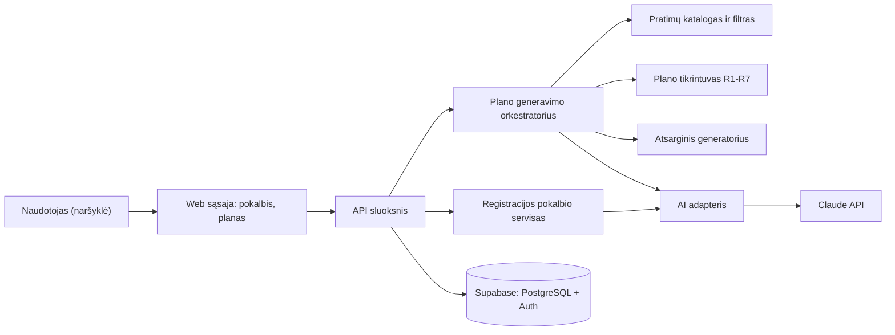

# Spotter

Kursinio darbo I dalis: projektavimo dokumentas

## 1. Problema ir idėja

**Sistema vienu sakiniu:** Spotter – web programa (SaaS), kurioje žmogus trumpai pasikalba su AI botu ir gauna savo tikslui, laikui, įrangai bei fiziniams ribojimams pritaikytą savaitės treniruočių planą, kurį prieš parodant patikrina sistemos saugumo taisyklės.

**Problema ir dabartinis procesas:** Pradedantieji sportuojantys dažniausiai renkasi vieną iš trijų kelių: (1) kopijuoja bendrus planus iš interneto ar socialinių tinklų – jie nepritaikyti jų laikui, įrangai ar traumoms; (2) klausia bendro pobūdžio pokalbių roboto (pvz., ChatGPT) – atsakymas gali atrodyti įtikinamai, bet niekas nepatikrina, ar plane nėra pratimų, kurių žmogus neturėtų daryti, ar treniruotė telpa į jo laiką, ar ta pati raumenų grupė negauna krūvio kelias dienas iš eilės; (3) samdo trenerį – tai kainuoja apie 30–50 € už treniruotę. Konkretus trūkumas: pigūs sprendimai nėra patikrinti, o patikrinti yra brangūs.

**Nauda:** Naudotojas per kelias minutes gauna asmeninį planą, kurio kiekvienas pratimas patikrintas pagal aiškias taisykles (įranga, ribojimai, laikas, poilsis, lygis). Jei AI pasiūlymas netinkamas, naudotojas jo nemato – sistema pataiso planą arba pateikia saugų supaprastintą variantą.

**Naudotojai:** Vienas naudotojo tipas – žmogus, norintis sportuoti savarankiškai. Jis: užsiregistruoja per AI pokalbį, patvirtina profilio santrauką, sugeneruoja savaitės planą, peržiūri jį ir prireikus sugeneruoja naują (pvz., pasikeitus laikui ar įrangai).

**Prielaidos:**
- Žinome: rinkoje yra AI planų įrankių (Everfit, Trainerize treneriams, Fitbod galutiniams naudotojams), todėl poreikis egzistuoja.
- Prielaida: pratimų kontraindikacijos (pvz., „kelis“ → be gilių pritūpimų) žymimos konservatyviai pačios sistemos pratimų kataloge; tai nėra medicininė rekomendacija.
- Prielaida: naudotojas ribojimus nurodo sąžiningai; sistema jų nediagnozuoja.
- Prielaida: pakanka savaitės plano, kuris kartojamas; progresas tarp savaičių šiame darbe neskaičiuojamas.

## 2. Apimtis

| Funkcija | Ką naudotojas galės atlikti | Pagrindinis modulis ar pagalbinė funkcija |
|---|---|---|
| Registracija per AI pokalbį | Atsakyti į boto klausimus; botas užpildo profilį (tikslas, lygis, dienos, trukmė, įranga, ribojimai), naudotojas patvirtina santrauką | Pagalbinė (su AI) |
| AI plano generavimas | Paspausti „Generuoti planą“ ir gauti savaitės planą | Pagrindinio modulio dalis |
| Plano tikrinimas ir taisymas | Gauti tik taisykles atitinkantį planą; jei AI klysta – pataisytą arba supaprastintą planą | **Pagrindinis modulis** |
| Plano peržiūra | Matyti dienas, pratimus, serijas, pakartojimus ir numatomą trukmę | Pagalbinė |
| Profilio keitimas | Pakeisti duomenis ir sugeneruoti naują planą | Pagalbinė |

**Į kursinio darbo apimtį neįeina:** mitybos planai, mokėjimai ir prenumeratų valdymas, mobilioji programėlė, integracijos su išmaniaisiais laikrodžiais ar sporto programėlėmis, progreso sekimas ir krūvio didinimas tarp savaičių, pratimų vaizdo įrašai, trenerių paskyros, medicininės rekomendacijos.

## 3. Pagrindinis modulis

**Pavadinimas ir atsakomybė:** *Plano generavimas ir tikrinimas.* Modulis iš patvirtinto profilio gauna AI sugeneruotą planą, patikrina jį taisyklėmis R1–R7, prireikus paprašo AI pataisyti, o po nesėkmių pateikia deterministinį supaprastintą planą. Naudotojui niekada neparodomas planas, pažeidžiantis bent vieną taisyklę.

**Logika, kurią reikės projektuoti ir testuoti:**
- pratimų katalogo filtravimas pagal profilį prieš kviečiant AI;
- AI atsakymo struktūros tikrinimas (JSON schema);
- plano tikrintuvas: taisyklės R1–R7, kiekviena grąžina pažeidimų sąrašą su kodu ir vieta plane;
- pakartotinio bandymo logika (AI gauna konkretų pažeidimų sąrašą);
- atsarginis (šabloninis) plano generatorius be AI.

**Įvestis:** patvirtintas profilis ir pratimų katalogas. Pavyzdys:
```json
{ "tikslas": "bendras_pasirengimas", "lygis": "pradedantysis",
  "dienos": ["Pr", "Tr", "Pn"], "trukmeMin": 45,
  "iranga": ["hanteliai"], "ribojimai": [] }
```
Pratimo įrašas kataloge: `{ "id": "db_press", "pavadinimas": "Hantelių spaudimas gulint", "raumenys": ["krūtinė"], "iranga": ["hanteliai"], "sudetingumas": 1, "kontraindikacijos": ["petys"], "minPerSerija": 2 }`

**Išvestis:** planas su būsena. Pavyzdys:
```json
{ "busena": "PARUOSTAS", "bandymai": 1, "pazeidimai": [],
  "dienos": [ { "diena": "Pr", "trukmeMin": 40,
     "pratimai": [ { "id": "db_press", "serijos": 3, "pakartojimai": "10-12" } ] } ] }
```
Galimos būsenos: `PARUOSTAS`, `SUPAPRASTINTAS` (atsarginis planas), `KLAIDA` (planas negalimas).

**Veikimo eiga:**
1. Patikrinamas profilis (visi laukai užpildyti, reikšmės leistinos).
2. Katalogas filtruojamas: lieka pratimai, kurių įranga yra naudotojo turima, be naudotojo ribojimų kontraindikacijų ir tinkamo sudėtingumo. Jei lieka mažiau nei 6 pratimai – grąžinama `KLAIDA` (AI nekviečiamas).
3. AI gauna profilį ir tik atfiltruotų pratimų sąrašą; atsakymą privalo grąžinti pagal JSON schemą.
4. Atsakymas tikrinamas schema, tada taisyklėmis R1–R7.
5. Jei pažeidimų nėra – `PARUOSTAS`. Jei yra – AI gauna pažeidimų sąrašą ir vieną kartą taiso (iš viso 2 bandymai).
6. Jei ir antras bandymas netinkamas – atsarginis generatorius sudaro viso kūno planą iš atfiltruotų pratimų (sudėtingumas 1, 3 serijos), jis taip pat patikrinamas R1–R7 ir grąžinamas su būsena `SUPAPRASTINTAS`.
7. Visi bandymai ir pažeidimai išsaugomi žurnale (kokybės vertinimui).

### Taisyklės arba sprendimo žingsniai

1. **R1 – žinomas pratimas:** kiekvieno pratimo `id` turi būti kataloge. Pažeidimas: `NEZINOMAS_PRATIMAS`.
2. **R2 – įranga:** visa pratimui reikalinga įranga turi būti naudotojo įrangos sąraše (pratimai be įrangos tinka visiems). Pažeidimas: `TRUKSTA_IRANGOS`.
3. **R3 – ribojimai:** pratimo kontraindikacijų ir naudotojo ribojimų sankirta turi būti tuščia. Pažeidimas: `KONTRAINDIKACIJA`.
4. **R4 – dienos:** treniruočių dienų skaičius lygus profilyje nurodytam, ir visos dienos yra tarp naudotojo pasirinktų savaitės dienų. Pažeidimas: `NETINKAMOS_DIENOS`.
5. **R5 – trukmė:** 10 min apšilimas + Σ(serijos × pratimo `minPerSerija`) ≤ profilio `trukmeMin` kiekvienai dienai. Pažeidimas: `VIRSYTA_TRUKME`.
6. **R6 – atsistatymas:** ta pati raumenų grupė negali būti treniruojama dvi kalendorines dienas iš eilės (įskaitant sekmadienį–pirmadienį). Pažeidimas: `NEPAKANKA_POILSIO`.
7. **R7 – lygis:** pratimo sudėtingumas ≤ naudotojo lygiui (pradedantysis 1, vidutinis 2, pažengęs 3); pradedančiajam – ne daugiau kaip 3 serijos pratimui. Pažeidimas: `PER_SUDETINGA`.

### Scenarijai būsimiems testams

| Scenarijus | Pradinės sąlygos ir konkreti įvestis | Veiksmas | Tikslus laukiamas rezultatas |
|---|---|---|---|
| Įprastas atvejis | Profilis: pradedantysis, dienos Pr, Tr, Pn, 45 min, įranga – hanteliai, ribojimų nėra. AI (imituotas) grąžina planą: kiekvieną dieną 5 viso kūno pratimai po 3 serijas, `minPerSerija` = 2 | Generuoti planą | Tikrintuvas grąžina 0 pažeidimų; kiekvienos dienos trukmė 10 + 15 × 2 = 40 min ≤ 45; būsena `PARUOSTAS`, `bandymai` = 1 |
| Ribinis atvejis arba konfliktas | Profilis: vidutinis, dienos Pr, An, Kt, Pn, 60 min, sporto salė, ribojimas – kelis. AI 1-as atsakymas: Pr ir An abiejose dienose yra krūtinės pratimai; Kt – „Pritūpimai su štanga“ (kontraindikacija: kelis). AI 2-as atsakymas – be šių klaidų | Generuoti planą | Po 1 bandymo pažeidimai: `NEPAKANKA_POILSIO` (krūtinė, Pr–An) ir `KONTRAINDIKACIJA` (Pritūpimai su štanga, Kt). AI gauna šiuos 2 pažeidimus. Po 2 bandymo – 0 pažeidimų; būsena `PARUOSTAS`, `bandymai` = 2; žurnale 2 įrašai |
| Ribinis atvejis – AI nepataiso | Tas pats profilis kaip ankstesniame. AI abu kartus grąžina planą su `VIRSYTA_TRUKME` (Pr: 10 + 30 × 2 = 70 min > 60) | Generuoti planą | Po 2 bandymų įjungiamas atsarginis generatorius; grąžinamas planas su 0 pažeidimų; būsena `SUPAPRASTINTAS`; naudotojui rodoma žinutė, kad pateiktas supaprastintas planas |
| Klaida arba neįmanomas rezultatas | Profilis: pradedantysis, namai be įrangos, ribojimai – kelis, nugara, petys. Po filtravimo lieka 3 pratimai (< 6) | Generuoti planą | AI nekviečiamas; būsena `KLAIDA`, kodas `NEPAKANKA_PRATIMU`; naudotojui siūloma pakeisti įrangą arba ribojimus; planas nesukuriamas |
| Klaida – netinkamas AI formatas | Bet kuris tinkamas profilis. AI grąžina tekstą, kuris neatitinka JSON schemos | Generuoti planą | Bandymas laikomas nesėkmingu (`NETINKAMAS_FORMATAS`); vykdomas 2-as bandymas; jei ir jis netinkamas – `SUPAPRASTINTAS` planas |

Tikrintuvas ir atsarginis generatorius bus testuojami be tikro AI – AI atsakymai testuose imituojami fiksuotais JSON failais, todėl rezultatai tikslūs ir pasikartojantys.

**Jei modulis naudoja AI:**
- *Įvesties paruošimas:* AI gauna tik struktūrizuotą profilį ir jau atfiltruotų pratimų sąrašą (`id`, pavadinimas, raumenys). Taip AI net neturi galimybės pasiūlyti pratimo, kurio naudotojas negali atlikti, o laisvas naudotojo tekstas į plano užklausą nepatenka.
- *Atsakymo tikrinimas:* JSON schema (struktūra, tipai), tada R1–R7. AI atsakymas laikomas nepatikimu, kol nepraeina abiejų patikrų.
- *Netinkamas rezultatas:* vienas taisymo bandymas su konkrečiu pažeidimų sąrašu, po to – deterministinis atsarginis planas. Jei AI API nepasiekiama (laukimo riba 30 s) – iškart atsarginis planas.
- *Kokybės vertinimas:* 20 iš anksto paruoštų profilių (įvairūs lygiai, įranga, ribojimai) paleidžiami su tikru AI. Kriterijai: ≥ 70 % planų be pažeidimų iš 1 bandymo; ≥ 90 % – per 2 bandymus; 100 % naudotojui grąžintų planų – be pažeidimų.
- *Registracijos pokalbis:* AI iš atsakymų ištraukia profilio laukus JSON formatu. Sistema tikrina leistinas reikšmes (pvz., dienų skaičius 2–6, trukmė 20–120 min); jei reikšmė netinkama ar trūksta – botas klausia pakartotinai. Profilis išsaugomas tik naudotojui patvirtinus santrauką. Kokybė vertinama 15 parašytų pokalbių rinkiniu: ≥ 90 % laukų ištraukiama teisingai.

## 4. Kokybės atributas

**Pasirinktas atributas:** Patikimumas (saugumas nuo netinkamo AI rezultato).

**Kodėl svarbus šiai sistemai:** Pagrindinė sistemos vertė – planas patikrintas. Jei naudotojas su kelio problema gautų pritūpimus, sistema būtų ne geresnė už bendrą pokalbių robotą, o galbūt ir žalinga.

**Tikrinimo scenarijus ir sąlygos:** 50 testinių profilių ir 30 dirbtinai sugadintų AI atsakymų (kiekvienas pažeidžia bent vieną R1–R7 arba neatitinka schemos), paduodamų per imituotą AI adapterį.

**Sėkmės kriterijus:** 100 % sugadintų atsakymų aptinkami su teisingu pažeidimo kodu; 0 planų su pažeidimais grąžinama naudotojui; kiekvienam profiliui grąžinama `PARUOSTAS`, `SUPAPRASTINTAS` arba `KLAIDA` (be neapdorotų išimčių).

**Numatytas projektavimo sprendimas:** tikrintuvas – atskiras, nuo AI ir duomenų bazės nepriklausomas modulis (grynos funkcijos); AI pasiekiamas tik per adapterio sąsają, kurią testuose galima pakeisti imitacija; išankstinis katalogo filtravimas; atsarginis generatorius, kurio rezultatas taip pat tikrinamas.

**Kaip patikrinsiu vėlesniame etape:** automatiniai testai (Vitest) su imituotu AI adapteriu; testų ataskaita repozitorijoje.

**Sprendimo kaina arba ribojimas:** pakartotinis AI kvietimas didina laukimo laiką ir API kainą; atsarginis planas mažiau asmeniškas; reikia rankomis prižiūrėti pratimų katalogą ir kontraindikacijų žymas.

**Papildomas atributas – palaikomumas.** *Scenarijus:* pridedama nauja taisyklė R8 „ne daugiau kaip 16 serijų vienai raumenų grupei per savaitę“. *Sėkmės kriterijus:* pridedamas 1 naujas failas ir 1 eilutė taisyklių registre; R1–R7 failai nekeičiami; visi ankstesni testai praeina. *Sprendimas:* kiekviena taisyklė realizuoja bendrą sąsają `Rule { code; check(plan, profile, catalog): Violation[] }`, tikrintuvas pereina taisyklių sąrašą. *Patikrinimas:* pakeitimo demonstracija su `git diff`. *Kaina:* šiek tiek daugiau pradinio struktūrinio kodo.

## 5. Pradinė sistemos struktūra

### Paprasta schema



| Sistemos dalis | Atsakomybė |
|---|---|
| Web sąsaja | Pokalbio langas registracijai, profilio santraukos patvirtinimas, plano peržiūra |
| API sluoksnis (Next.js serverio maršrutai, Vercel) | Sesijos tikrinimas, užklausų priėmimas, servisų kvietimas |
| Registracijos pokalbio servisas | Pokalbio eiga, profilio laukų ištraukimas ir reikšmių tikrinimas |
| Plano generavimo orkestratorius | Veikimo eigos 1–7 žingsniai: filtravimas, AI kvietimas, tikrinimas, bandymai, atsarginis planas |
| Plano tikrintuvas | Taisyklės R1–R7, pažeidimų sąrašas; nepriklauso nuo AI ir DB |
| AI adapteris | Vienintelė vieta, kuri kalbasi su AI API; schema, laukimo riba; testuose pakeičiamas imitacija |
| Supabase (PostgreSQL + Auth) | Naudotojų autentifikacija; profiliai, pratimų katalogas, planai, generavimo bandymų žurnalas |

**Planuojamos technologijos ir pasirinkimo priežastys:**
- **TypeScript** – viena kalba sąsajai ir serveriui, tipai padeda aprašyti planą ir taisykles.
- **Next.js (React)** – sąsaja ir API viename projekte.
- **Vercel** – Next.js talpinimas ir automatinis diegimas iš „GitHub“ repozitorijos; turiu šios platformos patirties iš ankstesnių projektų.
- **Supabase** – valdoma PostgreSQL duomenų bazė ir naudotojų autentifikacija vienoje vietoje; reliaciniai duomenys (naudotojas–profilis–planai), SQL migracijos, eilučių lygio prieigos taisyklės (RLS), kad naudotojas matytų tik savo duomenis.
- **Zod** – AI atsakymų ir profilio JSON schemos tikrinimas.
- **Claude API** – struktūrizuotas (JSON) atsakymas, gerai supranta lietuvių kalbą pokalbyje.
- **Vitest** – tikrintuvo ir orkestratoriaus automatiniai testai.

## 6. AI panaudojimas

### AI rengiant šį dokumentą

Taip, naudojau AI.

| Priemonė ir užduotis | Ką panaudojau | Ką atmečiau arba perrašiau ir kodėl | Kaip patikrinau |
|---|---|---|---|
| Claude – idėjų generavimas ir palyginimas | Idėjų sąrašą ir palyginimą pagal unikalumą, testuojamumą ir alternatyvas rinkoje | Atmečiau su buhalterija susijusias idėjas ir AI užklausų paskirstymą (per panašu į esamus sprendimus mano aplinkoje); atmečiau AI testų generatorių, nes sunku apibrėžti tikslų laukiamą rezultatą | Pats peržiūrėjau konkurentus (Everfit, Trainerize, Fitbod) |
| Claude – sistemos koncepcija | Plano tikrinimo taisyklių idėją ir pakartotinio bandymo eigą | Pakeičiau modelį iš „SaaS treneriams“ į „savarankiškas naudotojas“; registraciją formomis pakeičiau AI pokalbiu; mitybą išėmiau iš apimties | Taisykles ir scenarijus perskaičiavau rankomis (trukmės aritmetika, dienų gretimumas) |
| Claude – dokumento juodraštis | Struktūrą pagal šabloną ir formuluotes | Tikslinau prielaidas, kriterijus ir technologijų pasirinkimą pagal savo patirtį | Kiekvieną teiginį peržiūrėjau ir galiu paaiškinti |

### Planuojamas AI naudojimas kuriant sistemą

**Kur ir kam naudosiu AI:** kodo pasiūlymams (Claude Code), testinių profilių ir sugadintų AI atsakymų rinkiniams sudaryti, pratimų katalogo pirminiam sąrašui (vėliau peržiūrimam rankomis).

**Kaip tikrinsiu pasiūlymus ir sugeneruotą kodą:** kiekvienas pakeitimas – per „pull request“ su peržiūra; tikrintuvo taisyklėms testai rašomi pagal šio dokumento scenarijus prieš realizaciją; AI sugeneruotas katalogas peržiūrimas rankomis, ypač kontraindikacijos.

**Ar AI bus sistemos funkcionalumo dalis:** Taip. (1) Registracijos pokalbyje – profilio laukų ištraukimas iš naudotojo atsakymų; (2) plano generavime – savaitės plano sudarymas. Abiem atvejais AI rezultatą tikrina sistemos taisyklės.

## 7. Tolesnių darbų planas

| Darbas | Apčiuopiamas rezultatas | Planuojama darbų seka |
|---|---|---|
| Duomenų modelis ir pratimų katalogas | DB schema, ≥ 40 pratimų su raumenimis, įranga, sudėtingumu, kontraindikacijomis | 1 |
| Plano tikrintuvas R1–R7 | Modulis ir testai visiems 3 skyriaus scenarijams | 2 |
| AI adapteris, orkestratorius ir atsarginis generatorius | Veikianti eiga nuo profilio iki plano; testai su imituotu AI | 3 |
| Registracijos AI pokalbis | Pokalbis, profilio santrauka, patvirtinimas | 4 |
| Sąsaja ir AI kokybės matavimas | Plano peržiūros puslapis; 20 profilių ir 15 pokalbių vertinimo rezultatai | 5 |

**Būsimo prototipo veikimo scenarijus:** Naudotojas pokalbyje parašo: „Noriu sustiprėti, esu pradedantysis, galiu 3 kartus per savaitę po 45 min namuose, turiu hantelius, kartais skauda kelį.“ Botas paklausia, kurias dienas, gauna „pirmadienį, trečiadienį, penktadienį“ ir parodo santrauką. Naudotojas patvirtina ir spaudžia „Generuoti planą“. Tikimasi: 3 dienų planas (Pr, Tr, Pn), kiekviena diena ≤ 45 min, jokių pratimų su kontraindikacija „kelis“, jokios raumenų grupės gretimomis dienomis; bandymų žurnale matyti, ar AI planą reikėjo taisyti.

| Rizika arba neaiškumas | Kaip patikrinsiu arba sumažinsiu |
|---|---|
| AI dažnai grąžins taisykles pažeidžiančius planus, todėl daug planų bus supaprastinti | Anksti (3 darbo pradžioje) paleisti 20 profilių rinkinį; jei < 70 % tinka iš 1 bandymo – tobulinti užklausą, mažinti pratimų sąrašą, keisti modelį |
| Pratimų kontraindikacijų žymos netikslios | Konservatyvus žymėjimas (abejojant – žymėti), rankinė peržiūra, aiškus pranešimas, kad tai nėra medicininė rekomendacija |
| AI API laukimo laikas ir kaina; Vercel serverio funkcijų vykdymo laiko riba | 30 s laukimo riba ir atsarginis planas; funkcijos maksimalios trukmės nustatymas pagal Vercel planą; generavimo laiko ir žetonų matavimas žurnale |

## Šaltiniai, jei naudojote

- Everfit AI: https://everfit.io/ai/
- Trainerize, „AI for Personal Trainers“: https://www.trainerize.com/blog/ai-for-personal-trainers/
- Fitbod: https://fitbod.me/
