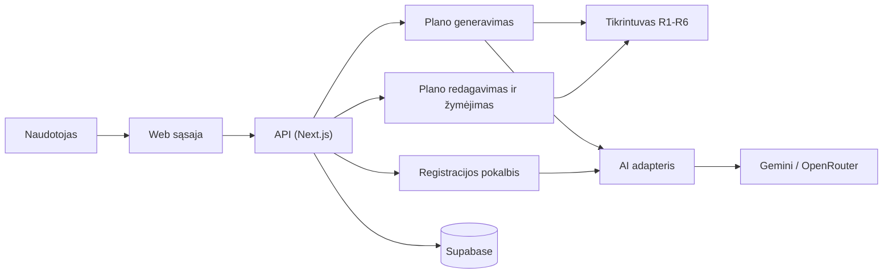

# Spotter

Kursinio darbo I dalis: projektavimo dokumentas

## 1. Problema ir idėja

**Sistema vienu sakiniu:** Spotter yra web programa, kurioje žmogus gali pats susidaryti treniruočių planą arba sugeneruoti jį su AI, o sistema patikrina, ar planas tinka jo laikui, įrangai ir fiziniams ribojimams.

**Problema ir dabartinis procesas:** Pradedantieji dažniausiai ima planus iš interneto arba klausia ChatGPT. Interneto planai nepritaikyti konkrečiam žmogui, o ChatGPT atsakymo niekas nepatikrina: plane gali atsirasti pratimų, kurių žmogus daryti neturėtų (pvz., pritūpimai skaudant kelį), treniruotė gali netilpti į turimą laiką, arba ta pati raumenų grupė treniruojama kelias dienas iš eilės. Treneris šias problemas išsprendžia, bet kainuoja brangiai. Be to, planas dažnai būna užrašytas užrašinėje ar Excel, todėl nepatogu žymėti, kas jau padaryta.

**Nauda:** Naudotojas vienoje vietoje turi planą, kuriuo gali pasitikėti, ir mato, kiek treniruočių šią savaitę jau atliko.

**Naudotojai:** Žmogus, kuris sportuoja savarankiškai. Jis užsiregistruoja per trumpą pokalbį su botu, sugeneruoja planą arba susikuria jį pats, prireikus redaguoja ir žymi atliktus pratimus.

**Prielaidos:**
- Rinkoje panašių įrankių yra (Fitbod, Everfit, Trainerize), tad poreikis realus.
- Pratimų kontraindikacijas pažymėsiu pats savo pratimų kataloge ir žymėsiu atsargiai. Tai nėra medicininė rekomendacija.
- Naudotojas ribojimus nurodo pats, sistema jų netikrina.

## 2. Apimtis

| Funkcija | Ką naudotojas galės atlikti | Pagrindinis modulis ar pagalbinė funkcija |
|---|---|---|
| Plano generavimas su AI ir tikrinimas | Gauti savaitės planą, kuris atitinka visas taisykles | **Pagrindinis modulis** |
| Rankinis plano kūrimas ir redagavimas | Pačiam sudėti pratimus, serijas ir dienas arba pakeisti AI planą; sistema parodo įspėjimus, jei kas nors pažeidžia taisykles | Pagalbinė (naudoja tą patį tikrintuvą) |
| Atliktų treniruočių žymėjimas | Pažymėti pratimą ar visą dieną kaip atliktą ir matyti savaitės progresą (pvz., „2 iš 3 treniruočių“) | Pagalbinė |
| Registracija per AI pokalbį | Atsakyti į boto klausimus. Botas užpildo profilį, naudotojas patvirtina santrauką | Pagalbinė |

**Į apimtį neįeina:** mityba, mokėjimai, mobilioji programėlė, laikrodžių integracijos, automatinis krūvio didinimas tarp savaičių, pratimų video.

## 3. Pagrindinis modulis

**Pavadinimas ir atsakomybė:** Plano generavimas ir tikrinimas. AI sudaro planą, tikrintuvas patikrina jį taisyklėmis R1–R6. Jei randa klaidų, AI jas taiso. Jei ir antras bandymas nepavyksta, sistema pati sudaro paprastą planą be AI. Naudotojas negauna sugeneruoto plano, kuris pažeidžia taisykles.

**Logika, kurią reikės projektuoti ir testuoti:** pratimų filtravimas prieš kviečiant AI, AI atsakymo formato tikrinimas, taisyklės R1–R6, pakartotinis bandymas ir atsarginis planas be AI.

**Įvestis:** profilis ir pratimų katalogas. Pvz.: pradedantysis, sportuoja Pr, Tr ir Pn po 45 min., turi hantelius, ribojimų nėra. Pratimas kataloge: „Hantelių spaudimas gulint“, raumenys: krūtinė, įranga: hanteliai, sudėtingumas 1, netinka skaudant petį, 2 min. vienai serijai.

**Išvestis:** savaitės planas (dienos, pratimai, serijos, pakartojimai, trukmė), būsena ir rastų pažeidimų sąrašas. Būsenos: `PARUOSTAS`, `SUPAPRASTINTAS` (planas be AI) arba `KLAIDA`.

**Veikimo eiga:**
1. Iš katalogo atrenkami pratimai, tinkantys pagal įrangą, ribojimus ir lygį. Jei jų lieka mažiau nei 6, grąžinama klaida ir AI nekviečiamas.
2. AI gauna profilį ir tik atrinktus pratimus ir grąžina planą JSON formatu.
3. Tikrinamas formatas, tada taisyklės R1–R6.
4. Jei klaidų nėra, planas išsaugomas. Jei yra, AI gauna klaidų sąrašą ir taiso vieną kartą.
5. Jei ir antras bandymas nepavyksta, sistema pati sudaro viso kūno planą iš atrinktų pratimų ir jį taip pat patikrina.

Rankiniu būdu sukurtam ar pakeistam planui naudojamas tas pats tikrintuvas, tik pažeidimai rodomi kaip įspėjimai ir naudotojas vis tiek gali išsaugoti planą.

### Taisyklės arba sprendimo žingsniai

1. **R1 Įranga:** pratimui reikalinga įranga turi būti naudotojo sąraše.
2. **R2 Ribojimai:** pratimas negali turėti kontraindikacijos, sutampančios su naudotojo ribojimu.
3. **R3 Dienos:** treniruočių dienų skaičius sutampa su profiliu, o visos dienos yra tarp naudotojo pasirinktų.
4. **R4 Trukmė:** 10 min. apšilimo + (serijos × minutės serijai) visiems dienos pratimams ≤ naudotojo nurodytos trukmės.
5. **R5 Poilsis:** ta pati raumenų grupė netreniruojama dvi dienas iš eilės (skaičiuojant ir sekmadienį su pirmadieniu).
6. **R6 Lygis:** pratimo sudėtingumas neviršija naudotojo lygio (1, 2 arba 3), o pradedančiajam skiriama ne daugiau kaip 3 serijos pratimui.

Be to, visi pratimai turi būti iš katalogo. AI negali pasiūlyti savo sugalvoto pratimo.

### Scenarijai būsimiems testams

| Scenarijus | Pradinės sąlygos ir konkreti įvestis | Veiksmas | Tikslus laukiamas rezultatas |
|---|---|---|---|
| Įprastas atvejis | Pradedantysis, Pr/Tr/Pn, 45 min., hanteliai. AI grąžina po 5 viso kūno pratimus po 3 serijas (2 min. serijai) | Generuoti planą | 0 pažeidimų, diena trunka 10 + 15 × 2 = 40 min., būsena `PARUOSTAS`, 1 bandymas |
| Konfliktas | Vidutinis lygis, Pr/An/Kt/Pn, 60 min., sporto salė, ribojimas: kelis. 1-ame AI atsakyme krūtinė treniruojama Pr ir An, o Kt yra „pritūpimai su štanga“. 2-as atsakymas be klaidų | Generuoti planą | Po 1 bandymo 2 pažeidimai: R5 (krūtinė Pr–An) ir R2 (pritūpimai, kelis). Po 2 bandymo 0 pažeidimų, būsena `PARUOSTAS`, 2 bandymai |
| AI nepataiso | Tas pats profilis, bet AI abu kartus grąžina Pr dieną su 30 serijų (10 + 60 = 70 min. > 60) | Generuoti planą | Du kartus R4 pažeidimas, tada sistema pati sudaro planą be pažeidimų, būsena `SUPAPRASTINTAS` |
| Klaida | Pradedantysis, namuose be įrangos, ribojimai: kelis, nugara, petys. Po filtravimo lieka 3 pratimai | Generuoti planą | AI nekviečiamas, būsena `KLAIDA`, naudotojui siūloma pakeisti įrangą arba ribojimus |
| Rankinis pakeitimas | Paruoštame plane naudotojas Tr dienai prideda „pritūpimus su štanga“, o ribojimas yra kelis | Išsaugoti | Rodomas R2 įspėjimas, planas išsaugomas su pažyma „yra įspėjimų“ |

Testuose AI atsakymai bus imituojami iš paruoštų JSON failų, todėl rezultatai visada bus vienodi.

**Jei modulis naudoja AI:** AI gauna tik struktūrizuotą profilį ir atrinktų pratimų sąrašą, ne laisvą naudotojo tekstą. Atsakymą tikrinsiu JSON schema ir taisyklėmis. Jei atsakymas netinkamas, darau vieną taisymo bandymą, po to naudoju atsarginį planą. Tą patį darau, jei AI neatsako per 30 s. Kokybę vertinsiu 20 paruoštų profilių rinkiniu. Tikslas: bent 70 % planų be klaidų iš pirmo karto ir bent 90 % per du bandymus. Registracijos pokalbyje AI ištraukia profilio laukus. Sistema tikrina, ar reikšmės leistinos (pvz., 2–6 dienos per savaitę), ir jei ne, klausia dar kartą. Profilis išsaugomas tik tada, kai naudotojas patvirtina santrauką.

## 4. Kokybės atributas

**Pasirinktas atributas:** patikimumas, t. y. naudotojas negauna AI plano su klaidomis.

**Kodėl svarbus šiai sistemai:** Tai yra visa sistemos esmė. Jei žmogus su skaudančiu keliu gautų pritūpimus, sistema niekuo nesiskirtų nuo paprasto ChatGPT.

**Tikrinimo scenarijus ir sąlygos:** 50 testinių profilių ir 30 specialiai sugadintų AI atsakymų (kiekviename bent viena R1–R6 klaida arba blogas formatas).

**Sėkmės kriterijus:** visi 30 sugadintų atsakymų aptinkami su teisinga taisykle, ir nė vienas sugeneruotas planas su klaida nepasiekia naudotojo.

**Numatytas projektavimo sprendimas:** tikrintuvas yra atskiras modulis be priklausomybės nuo AI ar duomenų bazės. AI kviečiamas per vieną adapterį, kurį testuose galima pakeisti imitacija. Atsarginis planas taip pat tikrinamas.

**Kaip patikrinsiu vėlesniame etape:** automatiniais Vitest testais.

**Sprendimo kaina arba ribojimas:** pakartotinis AI kvietimas ilgina laukimą ir didina kainą, o atsarginis planas yra mažiau asmeniškas.

## 5. Pradinė sistemos struktūra

### Paprasta schema

| Sistemos dalis | Atsakomybė |
|---|---|
| Web sąsaja | Pokalbis, plano peržiūra, redagavimas, atliktų pratimų žymėjimas |
| API | Prisijungimo tikrinimas ir kitų dalių kvietimas |
| Plano generavimas | Filtravimas, AI kvietimas, bandymai, atsarginis planas |
| Tikrintuvas | Taisyklės R1–R6, naudojamos ir AI, ir rankiniams planams |
| AI adapteris | Vienintelė vieta, kuri kviečia AI, todėl galima lengvai pakeisti modelį |
| Supabase | Naudotojai, profiliai, pratimų katalogas, planai, atlikti pratimai, AI bandymų žurnalas |

**Planuojamos technologijos ir pasirinkimo priežastys:**
- **Next.js (TypeScript)** ir **Vercel**: sąsaja ir serveris viename projekte, lengvas diegimas iš GitHub. Su šiais įrankiais jau esu dirbęs.
- **Supabase**: PostgreSQL duomenų bazė ir prisijungimas vienoje vietoje. RLS taisyklės leidžia kiekvienam naudotojui matyti tik savo duomenis.
- **Gemini API arba OpenRouter**: Gemini yra pigus ir palaiko JSON atsakymus. Per OpenRouter galėsiu palyginti kelis modelius ir pasirinkti geriausią.
- **Zod** AI atsakymams tikrinti ir **Vitest** testams.

## 6. AI panaudojimas

### AI rengiant šį dokumentą

Naudojau Claude.

| Priemonė ir užduotis | Ką panaudojau | Ką atmečiau arba perrašiau ir kodėl | Kaip patikrinau |
|---|---|---|---|
| Claude, idėjų paieška | Idėjų sąrašą ir palyginimą | Atmečiau kelias idėjas, kurios buvo per daug panašios į esamus sprendimus arba kurių sunku tiksliai testuoti | Pats peržiūrėjau konkurentus |
| Claude, sistemos aprašymas | Taisyklių ir pakartotinio bandymo idėją, dokumento juodraštį | Modelį treneriams pakeičiau į savarankišką naudotoją. Pridėjau registraciją per pokalbį, rankinį planą ir atliktų pratimų žymėjimą. Mitybą išėmiau. Pakeičiau stacką į Vercel, Supabase ir Gemini | Scenarijų skaičiavimus pasitikrinau rankomis, visus teiginius galiu paaiškinti |

### Planuojamas AI naudojimas kuriant sistemą

**Kur ir kam naudosiu AI:** kodo rašymui, testinių duomenų ir pratimų katalogo juodraščiui.

**Kaip tikrinsiu pasiūlymus ir sugeneruotą kodą:** testus tikrintuvui rašysiu pagal šio dokumento scenarijus, kodą peržiūrėsiu prieš commit. Pratimų kontraindikacijas tikrinsiu rankomis.

**Ar AI bus sistemos funkcionalumo dalis:** Taip. AI generuoja planą ir registracijos pokalbyje užpildo profilį.

## 7. Tolesnių darbų planas

| Darbas | Apčiuopiamas rezultatas | Planuojama darbų seka |
|---|---|---|
| Duomenų bazė ir pratimų katalogas | Supabase schema, bent 40 pratimų | 1 |
| Tikrintuvas R1–R6 | Modulis ir testai visiems scenarijams | 2 |
| AI generavimas ir atsarginis planas | Veikia kelias nuo profilio iki plano | 3 |
| Rankinis redagavimas ir žymėjimas | Galima keisti planą ir žymėti atliktus pratimus | 4 |
| Registracijos pokalbis | Profilis užpildomas per pokalbį | 5 |

**Būsimo prototipo veikimo scenarijus:** Naudotojas pokalbyje parašo: „Noriu sustiprėti, esu pradedantysis, galiu 3 kartus per savaitę po 45 min. namuose, turiu hantelius, kartais skauda kelį.“ Patvirtina santrauką ir sugeneruoja planą. Tikiuosi gauti 3 dienų planą, kurio kiekviena diena trunka ne ilgiau kaip 45 min., be pratimų, netinkančių kelio problemoms, ir be tos pačios raumenų grupės gretimomis dienomis. Tada pažymi pirmadienio treniruotę kaip atliktą ir mato „1 iš 3“.

| Rizika arba neaiškumas | Kaip patikrinsiu arba sumažinsiu |
|---|---|
| AI dažnai grąžins planus su klaidomis | Anksti paleisiu 20 profilių testą ir per OpenRouter palyginsiu kelis modelius |
| Netikslios pratimų kontraindikacijos | Žymėsiu atsargiai ir programoje aiškiai parašysiu, kad tai nėra medicininė rekomendacija |
| Vercel funkcijų laiko limitas, kai AI kviečiamas du kartus | 30 s riba ir atsarginis planas; laiką matuosiu žurnale |

## Šaltiniai

- Fitbod: https://fitbod.me/
- Everfit AI: https://everfit.io/ai/
- Trainerize, „AI for Personal Trainers“: https://www.trainerize.com/blog/ai-for-personal-trainers/
